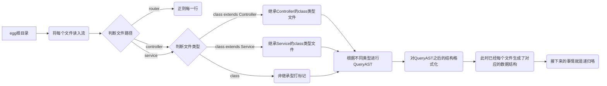

#  **TODO-LIST FOR ISSUES**
---
## **优化点**
+ **支持其他egg项目（比如收益挑战）**
  - 有些项目有router.js，有些没有是约定的
  - 加一个参数加以判断类型
  - router/controller/service的名称定义可配置，比如有的叫rpc有的叫controller
+ **特殊用例的归纳**
  - ().().()连续调用的问题
  - 连续解构的问题 const { obj1 } = obj; const { obj2 } = obj1; ...
  - require进来的如何处理
  - 有的用class有的用function
  - 循环引用的问题如何避免
  - 获取ctx.drm.get的参数
+ **匹配算法优化**
  - 基于esquery的方式寻找元素，是否有更好更完善的匹配规则
  - 目前是基于eslint espree进行的AST解析，是否可以用其他方案
  - 递归处理是否可以改为循环遍历，优点在于报错处理，方便恢复上下文，减少内存消耗。
+ **视图优化**
  - 将不同类型的节点进行分类，分颜色标识
  - 按照指定name进行搜索匹配
+ **数据结构优化**
  - 对于每个节点的存储节点目前是
    ```
      {
        id: uuid(),
        key: '名称',
        children: [{
          id: uuid(),
          key: '名称',
        }],
      }
    ```
    扩展数据结构具备更丰富的能力
+ **文件**
  - 最好一上来就能知道匹配的总文件数，方便控制整体进度


## **AST TOOL**
<https://astexplorer.net/>

## **整体思路**
**约定**
- 一个文件中只能存在一种情况 class 或者 function(s)
  ```
    // 文件导出class
    class A extends Controller {}
    module.exports = A;

    // 文件导出funcs
    exports.method1 = function() {};
    exoprts method2 = () => {};
  ```
- 调用proxy/fengdie/drm/service时不要多层解构
  ```
    const { ctx } = this;
    const { service } = ctx;
    const { user } = service;
    const { getName } = user;
    getName();
  ```
- 调用proxy/fengdie/drm/service后不要以chain的形式继续调用：例如
  ```
    this.ctx.service.user.getFriends().filter();
  ```
- 暂且对纯exports.funcs的文件打个标记，对没有extends Controller和Service的类打标记

**逻辑图**
